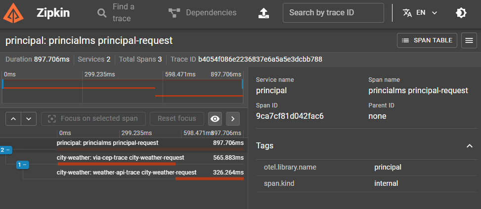

# Observabilidade

Implementação de observabilidade utilizando Opentelemetry e zipkin para monitorar a execução dos serviços que buscam a informação da localização e temperatura do usuario a partir do cep enviado pelo query string

## Fluxograma

O servidor web que recebe requisições HTTP, valida se o CEP enviado pelo usuário é válido e caso seja, realiza uma chamada http externa para o [via cep](https://viacep.com.br/) para encontrar os dados da cidade e com o nome da cidade, encontra a temperatura atual realizando uma chamada externa para o [wather api](https://www.weatherapi.com/), sendo o monitoramento dese fluxo realizado utilizando [Opentelemetry](https://opentelemetry.io/) e [Zipkin](https://zipkin.io/) para o trace.

## Executando o projeto

**Obs:** é necessário ter o [Docker](https://www.docker.com/) e [Docker Compose](https://docs.docker.com/compose/) instalados.

1. Crie um arquivo `.env` na raiz de cada projeto copiando o conteúdo de `.env.example` e ajuste-o conforme necessário. Por padrão, os seguintes valores são utilizados:

```sh
# cep
WEATHER_API_KEY=dd26ddd8f88d474288821638240707
REQUEST_NAME_OTEL=city-weather-request
OTEL_SERVICE_NAME=city-weather
OTEL_EXPORTER_OTLP_ENDPOINT=otel-collector:4317
HTTP_PORT=8081


# princpal
HTTP_PORT=8080
EXTERNAL_URL=http://cep:8181
REQUEST_NAME_OTEL=principal-request
OTEL_SERVICE_NAME=principal
OTEL_EXPORTER_OTLP_ENDPOINT=otel-collector:4317
```

2. Rode o comando

```
docker-compose up
```

### Request

| Endpoint | Descrição                                 | Método | Body |
| -------- | ----------------------------------------- | ------ | --------- |
| /        | Calcula a temperatura atual em uma cidade | POST    | {"cep": "cep desejado"}   |

**Requisição:**

```sh
$ curl -X POST -H "Content-Type: application/json" -d '{"cep": "01153000"}' http://localhost:8080/

# Response
{"temp_C":28.100000381469727,"temp_F":82.5999984741211,"temp_K":301.1000061035156}
```
**Zepkin:**
http://localhost:9411/zipkin/traces
